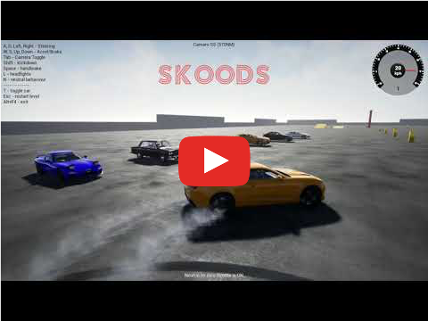
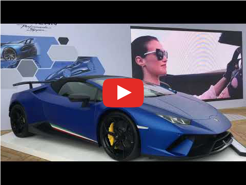
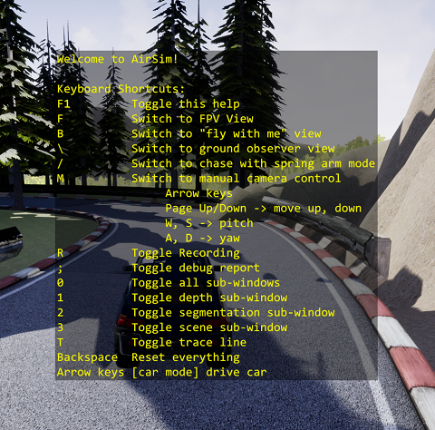

# Welcome to Skoods

Skoods is a Self-Racing Car Team, crowdsourced, running virtual competitions in our platform. We build simulation scenarios and models for self-driving cars as racing competitions.

Our community of pilots develops algorithms on our platform: learning, interacting and competing for the Podium.

Our mission is to have a real Self-Driving Car racing by 2020.

- Website: www.skoods.org

*Skoods Demo*

[](https://www.youtube.com/watch?v=8hI_HZZnYH0)

*Teaser: The Goodwood Festival Of Speed*

[](https://www.youtube.com/watch?v=X7a1ARVpse0)

## What's New

- October 25th, 2018 - Alpha Version Race: Release

## Quick Start

Here you can learn the steps to quickly start coding your own self-racing car.

### Requirements

Skoods competitions are currently supported to run on Windows 10 and Python 3.5.

### Download and Run the Competition Executable

1. Download the simulation:

[Alpha Version Race (Windows x64)](https://docs.zoho.com/file/akrkj92738de27bf94221a4f8867c6ba159b3)

2. Unzip the file.
3. Open the **AlphaVersionRace/** folder and double click the **AlphaVersionRace.exe** file to start the simulation.

NOTE 1: If it´s the first time you are running Skoods simulations, you will see the message: *"Would you like to use car simulation? Choose no to use quadrotor simulation."* Press **Yes** to continue.

NOTE 2: In the simulation, Press `F1` to see the list of commands available.




NOTE 3: You can see that the simulation will create a folder called **AirSim/** in your **Documents/** folder. Inside it, you can find a new file called `settings.json`. You will learn more about this file later on. Also, if you activate the **Recording** mode by pressing `R`, new files will be added to this same folder.

### Download and Install Anaconda

The open source Anaconda Distribution is the fastest and easiest way to do Python, data science and machine learning on Linux, Windows, and Mac OS X. It's the industry standard for developing, testing, and training on a single machine.

- Download and install the latest version: https://www.anaconda.com/download/

VIDEO TUTORIAL: [Python - Install Anaconda, Jupyter Notebook, Spyder on Windows 10](https://www.youtube.com/watch?v=Q0jGAZAdZqM)

### Create a Conda Environment

An environment consists of a certain Python version and some packages. Consequently, if you want to develop or use applications with different Python or package version requirements, you need to set up different environments.

We are currently developing and supporting Python version 3.5.

After installing Anaconda, Open the Anaconda Prompt app from the Start Menu and follow the instructions:

1. To create a new environment, type:

```comm
conda create -n skoods35 python=3.5
```

2. When conda asks you to proceed, type `y`:

```
proceed ([y]/n)?
```

3. After this process, check if the environment was created. To see a list of all of your environments, run in the Anaconda Prompt:

```
conda info --envs
```

## Activate Environment

Every time you want to control the car using the API, you must first activate the skoods35 environment.

In your Anaconda Prompt, run:

```
activate skoods35
```

## Install Additional Packages

PIP is a package manager for Python packages, or modules if you like. A package contains all the files you need for a module and modules are Python code libraries you can include in your project.

First, upgrade PIP itself:

```
pip install --upgrade pip
```

Then, follow the instructions to install 3 additional packages (this may need administrator or sudo prompt):

```
pip install msgpack-rpc-python
```

```
pip install airsim
```

```
conda install --channel https://conda.anaconda.org/menpo opencv3
```

If you use more Python packages in your code, you must install them here. Make sure the environment is activated before running the command.

## Run the Code

Before running the code, we must add a file that will define thee initial setting of the simulation.

Clone or download this repo to your local machine: https://github.com/skoods-org/welcome

Create a new folder in the Documents folder called AirSim.

Copy and paste the settings.json file to the new folder.

```
/Documents/AirSim/settings.json
```

Open the Anaconda Prompt and activate the airsim35 environment:

```
activate skoods35
```

Double click the AlphaVersionRace.exe file to start the simulation.

Navigate to the PythonExamples folder and run the hello_car.py file:

```
python hello_car.py
```

## (Optional) Download and Install Visual Studio Code

Visual Studio Code combines the simplicity of a source code editor with powerful developer tooling.

- Download: https://code.visualstudio.com/download
- More information: https://code.visualstudio.com/docs/editor/whyvscode

